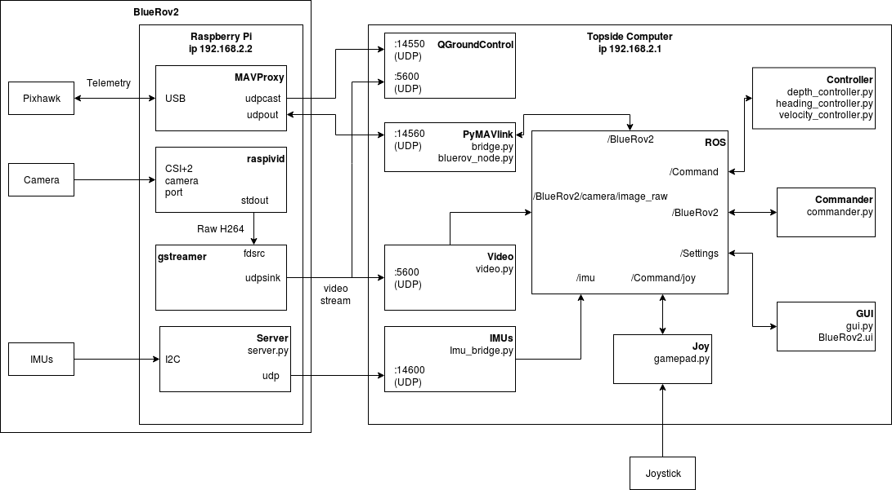

# aColor-BlueRov2 ROS implementation

## BlueRov2 

The BlueRov2 is a small ROV made and sold by the company Bluerobotics \([https://bluerobotics.com/store/rov/bluerov2/bluerov2/](https://bluerobotics.com/store/rov/bluerov2/bluerov2/)\). The ROV that we worked on has:

* 6 Thrusters T200 \([https://bluerobotics.com/store/thrusters/t100-t200-thrusters/t200-thruster/](https://bluerobotics.com/store/thrusters/t100-t200-thrusters/t200-thruster/)\)
* 6 Basic Esc
* 1 Bar30 pressure sensor \(link\) 
* 2 Leak sensors
* 4 Lumen Subsea Lights
* 1 Raspberry Pi 3B
* 1 camera
* 1 servo for the camera tilt
* 1 PixHawk \(Px4-v2\) : with internal 9 DOF IMU
* 2 Adafruit IMU : ref 9DOF
* 1 Fathom ROV tether

A more detailed list of the ROV component can be found at [https://bluerobotics.com/store/rov/bluerov2/bluerov2/](https://bluerobotics.com/store/rov/bluerov2/bluerov2/)

## Connection

According to the ArduSub documentation, The BlueRov2 require a to be linked to a topside computer. Image 2 shows a diagram of how it is connected to a topside controller with the ROS implementation.

