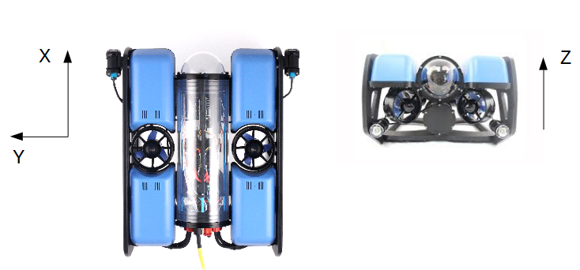

# Additional IMUs : client

## About IMUs

IMU stands for Inertial measurement unit, they are pretty common sensors for robotics application and of course used on the BlueROV2.

The BlueROV2 has 2 kinds of IMU:

* 1 PixHawk IMU for heading estimation
* 2 Adafruit LSM9DS1

   IMUs  for velocity estimation

The IMUs used have 9 DOF: 3 angular velocities, 3 linear accelerations, 1 magnetometer.

With those data it is possible to compute an orientation quaternion,  later used to calculate Euler angles.

## Why 2 IMUs ?

We used 2 IMUs in order to take the mean value, and therefore gain in accuracy.

\(ajouter lien research on imus + graphe influence nombre et résultat\) 

## Raw IMU data computation

[https://upcommons.upc.edu/bitstream/handle/2117/103849/MScLeslieB.pdf?sequence=1&isAllowed=y](https://upcommons.upc.edu/bitstream/handle/2117/103849/MScLeslieB.pdf?sequence=1&isAllowed=y)

Data from relatively cheap IMU are very noisy. The predominant error and noise sources are: 

* constant bias error: average output of the device over a specified time, there are 2 parts one deterministic part called bias offset and a random part. The bias offset can be determined by calibration. The random part is a stochastic process and refers to the rate at which the error in an inertial sensor accumulates with time.
* bias instability: random variation in the bias computed over a finite sample of time
* angle random walk \(gyros\): white noise
* velocity random walk \(accelerometer\): white noise

To improve the quality of raw data we implemented an exponential filter \(low-pass filter to cut white noise\) and we did the calibration of the IMUs to remove the bias offset. However we could not get rid of the random bias, which cause a drift after integration.

A solution to solve the issue would be to fuse IMU acceleration data with an other measurement of velocity from an other sensor \(DVL, GPS...\) in a Kalman filter. The IMU give a good short time estimation that needs to be corrected after a while with low frequency sensors, as GPS.

## About the code

### Receiving data

The code operate as client which subscribed to a [server](../companion-computer/additional-imus-server.md) running on Raspberry Pi. There is no data processing on the Raspberry Pi. The client requests data by sending "?" to the server and the server answer by sending IMUs data. They communicate at 100 Hz.  

### Data received format

Data sent by server are a dictionary  and the axes are those defined by the physical sensor on the robot 

{IMU1:{"time": t,   
"accel\_x": accel\_x,   
"accel\_y": accel\_y,   
"accel\_z": accel\_z,   
"mag\_x": mag\_x,   
"mag\_y": mag\_y,   
"mag\_z": mag\_z,   
"gyro\_x": gyro\_x,   
"gyro\_y": gyro\_y,   
"gyro\_z": gyro\_z,   
"temperature": temp},  
IMU2:{"time": t,   
"accel\_x": accel\_x,   
"accel\_y": accel\_y,   
"accel\_z": accel\_z,   
"mag\_x": mag\_x,   
"mag\_y": mag\_y,   
"mag\_z": mag\_z,   
"gyro\_x": gyro\_x,   
"gyro\_y": gyro\_y,   
"gyro\_z": gyro\_z,   
"temperature": temp}}

### Data published on the topic /imu/data\_raw 

Data are processed and then published on the topic /imu/data\_raw. The axis orientation is the same as PixHawk in the BlueRov2 configuration.



### Data Processing

First data are organized to fit the PixHawk IMU configuration. Then they are calibrated according to the calibration file. Finally they are filtered by a IIR low pass filter.

#### Calibration file 

Calibreration files are in the

There are two calibration files, one for each adafruit IMU. For each parameter, the result after calibration is :

$$
Calibrated Value = (Measured Value - offset)/scale
$$

```text
{
"acc_unit" : "m.s^-2", 
"acc_off_x" : 0.363, 
"acc_off_y" : 0.016,
"acc_off_z" : -0.070,
"acc_scale_x" : 1,
"acc_scale_y" : 1,
"acc_scale_z" : 1,

"gyr_unit": "degrees per second",
"gyr_off_x" : -4.64 , 
"gyr_off_y" : 3.39,
"gyr_off_z" : 0.772,
"gyr_scale_x" : 1,
"gyr_scale_y" : 1,  
"gyr_scale_z" : 1,

"magn_unit": "",
"magn_off_x" : -672,
"magn_off_y" : -241,
"magn_off_z" : -514,
"magn_scale_x" : 376.433798,
"magn_scale_y" : 409.322561,
"magn_scale_z" : 475.686674 
}
```

In the example of a calibrated file, _acc_ is for acceleration values, _gyr_ for gyroscope values, and _magn_ for magnetic value, _off_  means offset and _scale_ is for scale.


To calibrate the magnetometer we used a modified version of FreeIMU GUI calibration tool : [https://github.com/nathanfourniol/FreeIMU-gui-ROS](https://github.com/nathanfourniol/FreeIMU-gui-ROS)

For accelerometer and gyroscope we recorded data when the ROV was motionless. We averaged for each axis. The average value is our offset. and the scale is 1.


#### IIR filter

$$
y[n] = a*x[n] + (1-a)*y[n-1]
$$

Where y is the output and x the measured vector, a is the smoothing value. In our case a = 0.3.

## 


