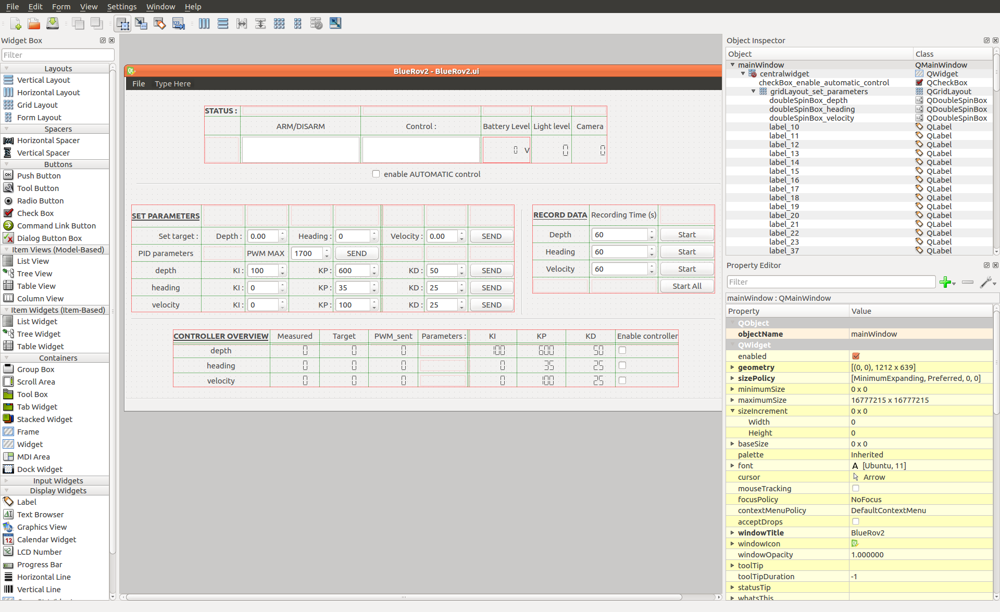

# GUI modification

The best way to modify the GUI is to use QtDesigner 5. Usually its comes with PyQt5. Otherwise if you have PyQt5 already install, you can install QtDesigner with :

```text
sudo apt-get install qttools5-dev-tools
```

The GUI modification has two steps. The first one is to add a widget with Qt designer, the second step is to link the object created with the code running the GUI.

## Add Widget

First you will have to opened the file BlueRov2.ui in QtDesigner 5. This file is a ML file with the apearance and most of the properties of the gui.



To add a widget you can drag and drop one widget from the widget box \(left panel\) to the view of the window in the center. Then you will have to modify the name and the properties of the widget using Property Editor \(e.g.  give it a more representative name \(parameter : objectName\)\). You can see your widget in the Object Inspector with its legacy and the tree dependacies of your object. Once you did that you can save the file. If it is a widget that require no interactions \(e.g. line, a layout, a constant label\(Text\)\) the modification is finished. You can launch the gui.py file to see what is new. Otherwise if it is a button, a checkbox or something that display text or figures, you will need to link its actions to a function to interact with it.  


If you don't have \(or close accidentally\) Widget Box, Property Editor or Object Inspector you can reopened them in the View menu \(the three first option\) 


## Link with code

Basically the code loads the BlueRov2.ui file with the function loadUi and interacts with it. So the name of the widget is the name from objectName property in QtDesigner and because it is a python class, the access is made by self.\[objectName\] .

### \_\_init\_\_

First step is to go to the \_\_init\_\_ method to deal with the initialization of the widget.

If you added pushButton or checkBox you will need to link the action when it is clicked with the method clicked. It will be something like that : 

```text
self.pushButton.clicked.connect(self.funtionToRaise)
```

After that, you will need to define the function to raise and place it above the \_\_init\_\_ method.

If you added widget to display information, to define the variable to dispaly see this two functions :

| Widget |  function |
| ---: | :--- |
| Text browser | self.objectName.setText\('string to display'\) |
| LCD number | self.obkectName.display\(number\) |

## More information

PyQt tutorial and documentation : [https://www.tutorialspoint.com/pyqt/index.htm](https://www.tutorialspoint.com/pyqt/index.htm)   
Qt documentation: [https://doc.qt.io/qt-5/](https://doc.qt.io/qt-5/)  
For video tutorials there is plenty on youtube, but this playlist [https://www.youtube.com/playlist?list=PLQVvvaa0QuDdVpDFNq4FwY9APZPGSUyR4](https://www.youtube.com/playlist?list=PLQVvvaa0QuDdVpDFNq4FwY9APZPGSUyR4) explains an shows the different widgets and their functions.

