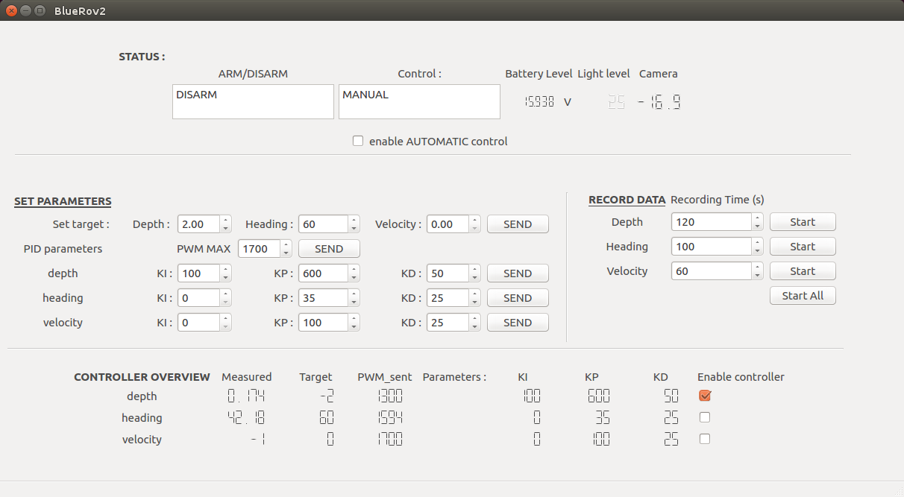
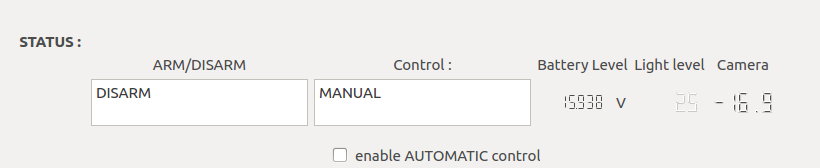
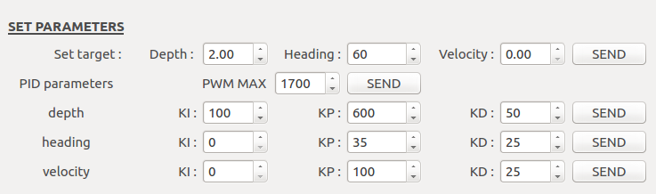
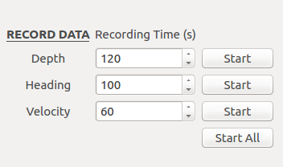
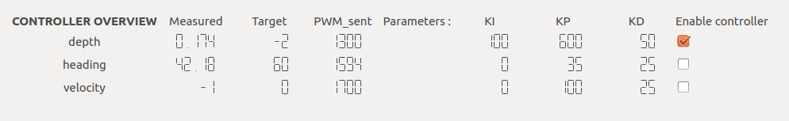

# Graphical User Interface \(GUI\)

## Graphical aspect

### Description of the GUI




| Components | Description |
| ---: | :--- |
| ARM/DISARM | Show the arm status of the BlueRov2 |
| Control | MANUAL : ROV controlled by gamepad  AUTOMATIC : ROV controlled by the depth/heading/velocity controllers   |
| enable AUTOMATIC control | Allow to enable AUTOMATIC mode without a gamepad |
| Battery Level | Display battery level in volt \(to not damage the battery it is recommend to not go under 3V by cells : e.g. for a 4S LI-Ion battery do not go under 12V\)  |
| Light level | light level of the lights in %, 0: turned off, 100% : highest brightness |
| Camera | Camera angle : between -45 to 45 deg |




<table>
  <thead>
    <tr>
      <th style="text-align:right">Components</th>
      <th style="text-align:left">Description</th>
    </tr>
  </thead>
  <tbody>
    <tr>
      <td style="text-align:right">Set target</td>
      <td style="text-align:left">
        
Depth : in m, 1m = 1m depth

        
Heading : in deg, 0 is North

        
Velocity : in m/s (the controller is not working)

        
SEND : publish on /Settings/set_target

      </td>
    </tr>
    <tr>
      <td style="text-align:right">PWM MAX</td>
      <td style="text-align:left">
        
Set the pwm maximal for <b>all</b> controllers. Uses in saturation method
          in controllers.

        
At the init the pwm maximal is 1700

      </td>
    </tr>
    <tr>
      <td style="text-align:right">PID parameters</td>
      <td style="text-align:left">
        
To tune PID for each controller. Press SEND for each controller to change
          PID parameters. The message is sent on the topics /Settings/set_[depth/heading/velocity].

        
KI, KP, KD = integral, proportional, derivative coefficients

        
<b>Note :</b> heading and velocity controller have no KI, changing this
          parameter will have no effect.

      </td>
    </tr>
  </tbody>
</table>




This area allows to record data by launching a rosbag record command described below. You can change the record time, in s, up to 3600s. The record time from Start All button is the maximum of the three record time parameters.

The files are recorded in **~/.ros** folder. Rosbag file will be named as  
\[depth/heading/velocity\]\[year\]-\[month\]-\[day\]-\[hours\]-\[minutes\]-\[seconds\].bag

| Choice | Topics recorded |
| :--- | :--- |
| Depth | /BlueRov2/bar30 ; /BlueRov2/state ;  /Settings/set\_depth ; /Settings/set\_target ; /Command/depth |
| Heading |  /BlueRov2/imu/attitude ; /BlueRov2/state ; /Settings/set\_heading ; /Settings/set\_target ; /Command/heading |
| Velocity | /imu/imu\_raw ; /BlueRov2/state ; /Settings/set\_velocity ; /Settings/set\_target ; /Command/velocity |
| All | /BlueRov2/bar30 ; /BlueRov2/imu/attitude ; /imu/imu\_raw ; /BlueRov2/state ; /Settings/set\_depth ; /Settings/set\_heading ; /Settings/set\_velocity ; /Settings/set\_target ; /Command/depth ; /Command/heading ; /Command/velocity |


The velocity is not recorded as velocity but only acceleration are recorded with the topics /imu/data\_raw





It's an overview of the controllers with a preview of the controllers output in the column PWM\_sent. The checkbox can be check to enable the controller to drive the ROV if the AUTOMATIC mode otherwise it will not work until the AUTOMATIC mode is on.

Units are meters for altitude \(eg : 0.174m=0.174m above the surface, -2m is 2m under surface\), degrees for heading in range 0-360, velocity is not estimated yet so is always written -1. See here [velocity control](controllers/velocity-control.md).



## ROS

### Node

GUI

### Topics

| ROS message subscribed | Message | Description |
| :---: | :---: | :--- |
| /BlueRov2/State | bluerov\_ros\_playground/State |  State of the ROV : arm status, thrusters pwm, light level, camera tilt  |
| /BlueRov2/battery | sensor\_msgs/BatteryState | Battery state |
| /BlueRov2/bar30 | bluerov\_ros\_playground/Bar30 | Absolute pressure |
| /BlueRov2/imu/attitude | bluerov\_ros\_playground/Attitude | Contain yaw data |
| /Command/depth | UInt16 | pwm sent by depth controller for the pwm preview |
| /Command/heading | UInt16 | pwm sent by heading controller for the pwm preview |
| /Command/velocity | UInt16 | pwm sent by velocity controller for the pwm preview |
| /Command/Joy | UInt16 | To switch the mode display \(the real switch is in [commander.py](commander.md)\) |
| /Settings/set\_depth | bluerov\_ros\_playground/Set\_depth | To  read depth controller settings |
| /Settings/set\_heading | bluerov\_ros\_playground/Set\_heading | To read heading controller settings |
| /Settings/set\_velocity | bluerov\_ros\_playground/Set\_velocity | To read velocity controller settings |
| /Settings/set\_target | bluerov\_ros\_playground/Set\_target | To read target to reach |

| ROS message published | Message | Description |
| :---: | :---: | :--- |
| /Settings/set\_depth | bluerov\_ros\_playground/Set\_depth | send depth controller settings |
| /Settings/set\_heading | bluerov\_ros\_playground/Set\_heading | send heading controller settings |
| /Settings/set\_velocity | bluerov\_ros\_playground/Set\_velocity | send velocity controller settings |
| /Settings/set\_target | bluerov\_ros\_playground/Set\_target | send target to reach in depth, heading and velocity |

